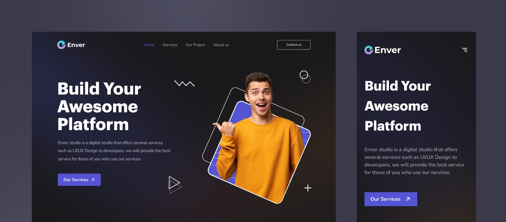

# Enver - Digital Agency

 Digital studio website




### Main folders

- `/build` The build folder
- `/source` Source files

### Directory structure

```
├── build
├── source
│   ├── fonts
│   │   ├── font.woff
│   │   ├── font.woff2
│   ├── img
│   │   ├── favicon
│   │   ├── icons
│   │   ├── logo
│   │   ├── ...
│   │   ├── img.png
│   │   ├── img.jpg
│   │   ├── img.svg
│   ├── js
│   │   ├── plugins
│   │   ├── script.js
│   ├── scss
│   │   ├── blocks
│   │   ├── elements
│   │   ├── global
│   │   ├── helpers
│   │   ├── mixins
│   │   ├── plugins
│   │   ├── style.scss
│   ├── index.html   
├── .editorconfig
├── .gitattributes
├── .gitignore
├── .stylelintrc
├── gulpfile.js
├── package.json
├── package-lock.json
└── README.md
```

## How to use

1. Clone or  download from GitHub
2. Install Node Modules: **npm i**
3. Run: **gulp**

## Gulp tasks:

```
gulp build
```

Optimization CSS, JS, HTML, IMG, SVG. create WebP, SVG sprite. Create build folder and copy source files, live server + watcher

## Copyright and license [](https://camo.githubusercontent.com/0ce16c13342cc4668c809a506af95a4a9a710f855a7f26ace542d7fa2c4f6a75/68747470733a2f2f696d672e736869656c64732e696f2f6769746875622f6c6963656e73652f6a6774686d732f62756c6d613f6c6f676f3d476974687562)

Code released under [the MIT license](https://github.com/jgthms/bulma/blob/master/LICENSE).